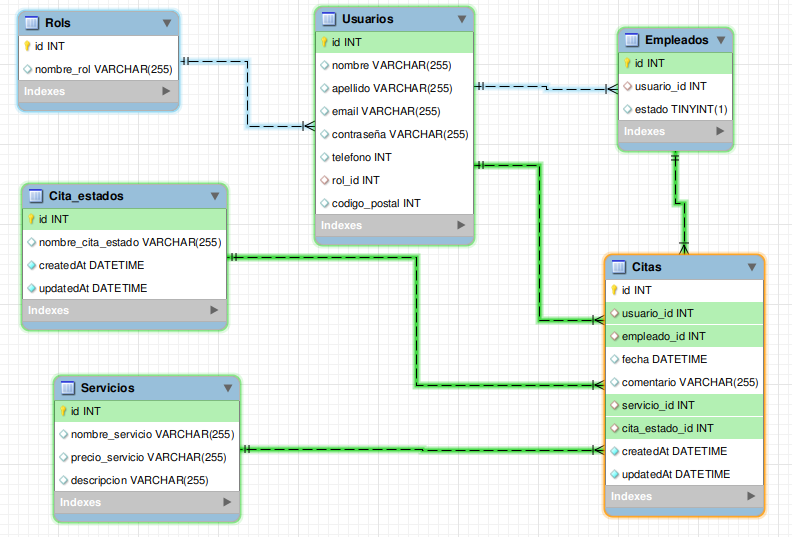

### Proyecto final GeeksHubs Academy:
# Backend Barbería con BD.

  
Contenido 📝

  <ol>
    <li><a href="#finalidad">Objetivo</a></li>
    <li><a href="#acerca-de">Acerca de</a></li>
    <li><a href="#tecnologías-utilizadas">Tecnologías utilizadas</a></li>
    <li><a href="#diagrama-er">Diagrama Entidad Relación</a></li>
    <li><a href="#instalación-en-local">Instalación en local</a></li>
    <li><a href="#agradecimientos">Agradecimientos</a></li>
    <li><a href="#endpoints">Endpoints</a></li>
    <li><a href="#repositorio">Contacto</a></li>
    <li><a href="#estado">Estado</a></li>
  </ol>

## Objetivo:
El objetivo de este proyecto es crear una Base de Datos y una API funcional para gestionar clientes, citas, empleados y servicios de una barbería que actualmente ya está en funcionamiento.

## Acerca de:
He desarroyado esta API como proyecto final del ***Bootcamp de Full Stack Developer de GeeksHubs Academy***. Se basa en un backend de una barbería. Se ha usado ***Postman*** para hacer las consultas y ***Workbench*** para consultar la BD en el desarrollo.

## Tecnologías utilizadas:
         

## Diagrama Entidad Relación:

## Instalación en local
1. Clonar el repositorio
2. ` $ npm install `
3. Conectamos nuestro repositorio con la base de datos
4. Ejecutamos las migraciones
` $ sequelize db:migrate `
5. Ejecutamos los seeders
` $ sequelize db:seed:all `
6. Levantamos el servidor de express
` $ npm run dev `

## 
Endpoints:

Endpoints

- **Auth**
    - **Register:**
    **/auth/registro**
    {
    "nombre": "Roberto",
    "apellido": "Delgado",
    "email": "roberto@mail.com",
    "telefono": "722653007",
    "codigo_postal": 46900,
    "contraseña": "admin123"
    }
    - **Login:**
    **/auth/login**

        {
    "email": "roberto@mail.com",
    "contraseña": "admin123"
    }

    - **Token** 
Copias el token de aquí:

Y lo pegas aquí:

- **Usuario(como usuario)**
    - **Ver mi perfil de usuario:**    
    **/usuario/perfilUsuario**
    {}
    -----------------------------
    - **Modificar mi perfil de usuario:**
    **/usuario/modificarPerfil**

    {
    "nombre": "Roberto",
    "apellido": "Delgado",
    "email": "roberto@mail.com",
    "telefono": "722653007",
    "codigo_postal": 46900,
    "contraseña": "admin123"
    }
    - **Solicitar una cita:**
    **/cita/solicitarCita**

    {
    "empleado_id": 1,
    "fecha": "2023-08-09T16:30:00",
    "servicio_id": 11,
    "comentario": "Quiero tintarme la barba"
    }
    - **Ver mis citas:**
    **/cita/misCitas**
    {}
    - **Cancelar una cita por id:**
    **/cita/cancelarCita/1 <=(ID)**
    {}

    - **Ver empleados:**
    **/usuario/verEmpleados**
    {}

    - **Ver servicios:**
    **/usuario/verServicios**
    {}

- **Empleado(como empleado)**
    - **Ver todas las citas pendientes**
    **/empleado/todasLasCitas**
    {}
    - **Modificar citas por id:**
    **/empleado/modificarCita/4 <= (ID)**
    - {
    "empleado_id": 1,
    "fecha": "2023-08-10T17:30:00",
    "servicio_id": 9,
    "comentario": "Quiero decolorarme el pelo color platino"
    "cita_estado_id": 2
    }

    - **Cancelar citas por id:**
    **/empleado/cancelarCita/4 <=(ID)**
    {}

    - **Filtrar citas por nombre usuario**
    **/empleado/citasPorUsuario/Roberto <=(Nombre Usuario)**
    {}

    - **Obtener estados cita:**
    **/empleado/obtenerEstados**
    {}

- **Admin(como admin)**
    - **Ver todos los usuarios:**
    **/admin/todosLosUsuarios**
    {}
    - **Eliminar usuarios por id:**
    **/eliminarUsuario/5 <=(ID)**
    {}

- ***Se van a agregar mas endpoints, pero primero voy a hacer el minimo producto viable y ya se iran añadiendo muchos mas.***

## Agradecimientos:
**Agradezco a mis profesores la paciencia y la ayuda que me han mostrado durante todo el bootcamp. También el buen rollo que crean en clase y todo lo que me han enseñado estos últimos meses.**

**Agradezco también a todos mis compañeros la ayuda recibida durante estos meses, en parte gracias a ellos hoy he podido hacer este proyecto por mi cuenta y aun me siguen ayudando en todo lo que pueden. Mil gracias.**

## Repositorio:
https://github.com/xIMet3/backendPeluqueria

## Estado:
### 🚧🚧En desarollo🚧🚧

